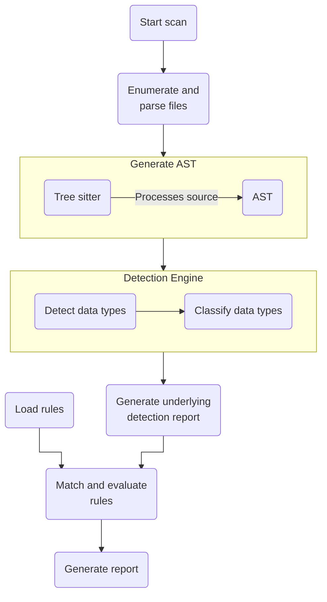

# How Bearer CLI works

This page contains a breakdown of how the Bearer CLI SAST scan works. For most use cases, the basic explanation will be enough to get you started. If you'd like to dive deeper, check out the [advanced concepts](#advanced-concepts) below.

## High level overview

At a high level, Bearer CLI scans the files in a project, creates an AST representation of the code using [tree sitter](https://tree-sitter.github.io/tree-sitter/), performs [data discovery and classifications](/explanations/discovery-and-classification/) and updates the tree, and generates an internal detectors report that each report type can use. For example, the [security report](/explanations/reports#security-report) checks that report against a set of [rules](/reference/rules/).

When you run a scan for the first time with the default settings, the application flow looks like the following diagram:



With the exception of loading rules from the [bearer-rules](https://github.com/bearer/bearer-rules) repo and checking the latest version, everything happens locally in your environment.

While there is some variation for each report type, the files to AST to detection report process is the core of each Bearer CLI scan. Learn more by reviewing explanations of the [sensitive data flow process](/explanations/discovery-and-classification/) and [dynamic severity system](/explanations/severity).

## Advanced concepts

Now that you have an understanding of the CLI workflow, let's look at the concepts of data flow analysis, control flow analysis, and type analysis.


### Dataflow analysis

Dataflow analysis enables us to track the flow of data through the application to determine if input is validated before use. This involves the concept of identifying “tainted” or potentially harmful input. All data entering the application is considered harmful (i.e., tainted). Tainted data can be cleaned by using a sanitizer.

Dataflow is the path that data takes as it enters (e.g., HTTP request), traverses through the application, and ultimately leaves the application as output. Analyzing the dataflow provides insight into how the application processes data.

- A source is the point in the code where external data passes into the application.
- A sink is a code location that could be abused if malicious data reaches it (i.e. tainted source).
- A sanitizer is a function that will clean a tainted source.
  - Sanitizers may only make data safe for a specific task, such as escaping HTML special characters.

Here is an example using cross-site scripting (XSS) in Java:

```java
String userInput = req.getQueryString("user");
response.getWriter().write(userInput);
```

`userInput` is identified as tainted since it enters the application (source) and, as we follow the dataflow up to the response writer (the sink), the tainted data is never cleaned. A vulnerability will be raised.

```java
String userInput = req.getQueryString("user");
String encodedUserInput = Encode.forHtml(userInput);
response.getWriter().write(encodedUserInput);
```

The above is the same example, but this time the `userInput` is clean as it gets sanitized by `Encode.forHtml()` and the vulnerability will not be raised.

We need to recognize expressions in the code that are sources of tainted data. These are the places that bring tainted data into the application from external locations. We also need to identify the sinks for tainted function calls that use the tainted data. Once we have identified all sources and sinks, the analyzer identifies functions that sanitize the tainted data. If the analyzer isn’t able to confirm that the data is harmless, it identifies an error for tainted data reaching a sink.

Tracing the data source and identifying whether it is sanitized before use in sensitive locations is the most difficult part. That’s why we have the ability to customize and expand the rules and add custom sanitizers. This allows the analyzer to recognize that sanitization is taking place and prevents false positives for data flowing through these functions.

We perform a [points-to analysis](https://en.wikipedia.org/wiki/Pointer_analysis) for local variables. A variable resolves to the last assignment of that variable. The points-to analysis establishes links between variables and their associated values. This allows sources to be found when the sink is using a variable.

While analyzing the dataflow, we also propagate constant values for strings, which allows us to recreate and identify the entire string.

For example, a URL could be decomposed like this:

```java
String scheme = "https://"
String apiBase = scheme + "api.example.com/v1";
URL url = new URL(apiBase + "/cats");
HttpURLConnection con = (HttpURLConnection) url.openConnection();
con.setRequestMethod("GET");
```

By propagating the string, we are able to resolve the string and identify if the string is used securely (via HTTPS) or not (HTTP).

### Control flow analysis

Control flow analysis recognizes what the program control flow is upon execution. The engine's design enables security rules that look for insecure operational order.

The control flow analyzer detects potentially dangerous operational sequences. The engine determines whether a set of operations execute in a particular order by analyzing control flow paths in a program.

For example, a security rule requires the initialization of the session after the static assets are initialized in ExpressJS (to avoid leaking information when serving the assets).

This code needs to raise an alert:

```jsx
app.use(session({}))
app.use(express.static(__dirname + "/public"))
```

While this one should not:

```jsx
app.use(express.static(__dirname + "/public"))
app.use(session({}))
```

### Type analysis

We perform some type analysis to allow for security issues that are related to the type of data being passed more than where it’s coming from. Sensitive data is another source of tainted data that can be used in rules.

For this we support type inference (finding attributes of structured types) (e.g. `user.email` or `user["email"]`, etc.) as well as discovered types and schema is classified.

If we take this code snippet as an example:

```tsx
interface User {
  email: string
  gender: string
}

let user: User = {
  email: "foo@example.com",
  gender: "male",
}

console.log(`User is: ${user}`)
```

We take a user as the source and analyze the context of the source. We know that a user contains some personal information, and that may leak into the logger (sink). Therefore, we are able to report that as a failure.

---

Want to know more about inner workings of Bearer CLI? Let us know on the [community Discord]({{meta.links.discord}}) or on [GitHub]({{meta.links.issues}}).
