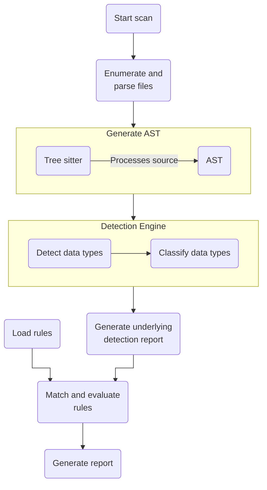

# How Bearer CLI works

At a high level, Bearer CLI scans the files in a project, creates an AST representation of the code using [tree sitter](http://tree-sitter.github.io/tree-sitter/), performs [data discovery and classifications](/explanations/discovery-and-classification/) and updates the tree, and generates an internal detectors report that each report type can use. For example, the [security report](/explanations/reports#security-report) checks that report against a set of [rules](/reference/rules/).

When you run a scan for the first time with the default settings, the application flow looks like the following diagram:

With the exception of loading rules from the [bearer-rules](https://github.com/bearer/bearer-rules) repo and checking the latest version, everything happens locally in your environment.

While there is some variation for each report type, the files to AST to detection report process is the core of each Bearer CLI scan. Learn more by reviewing explanations of the [sensitive data flow process](/explanations/discovery-and-classification/) and [dynamic severity system](/explanations/severity).

Want to know more about inner workings of Bearer CLI? Let us know on the [community Discord]({{meta.links.discord}}) or on [GitHub]({{meta.links.issues}}).